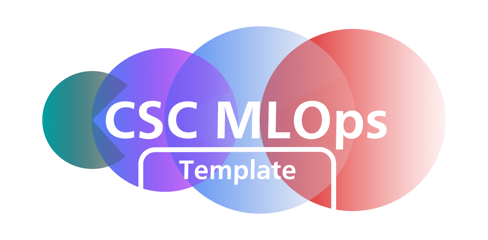
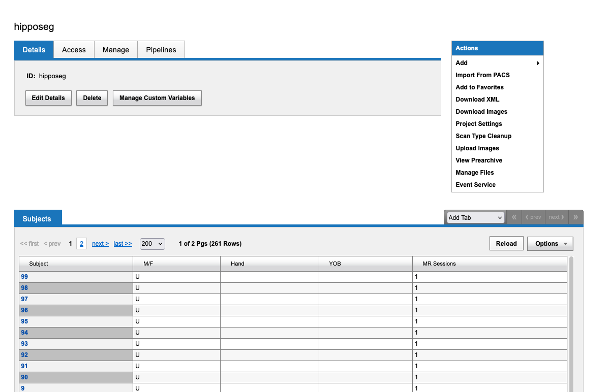
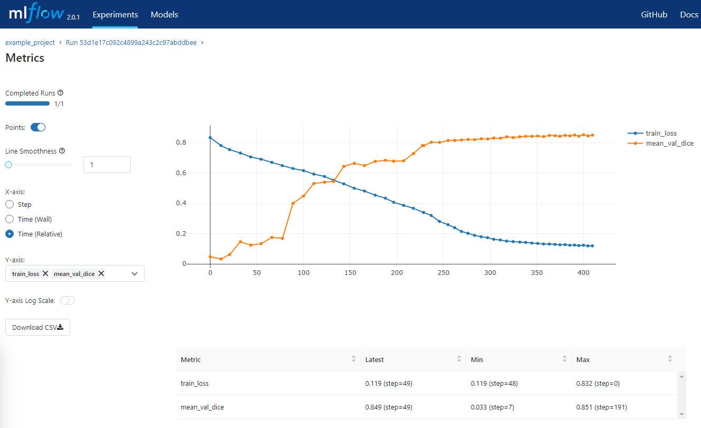

<!-- PROJECT HEADING -->
<br />
<p align="center">
<a href="https://github.com/github_username/repo_name">
    
  </a>
<p align="center">
A framework for AI applications for healthcare
<br />
<br />
<a href="https://github.com/GSTT-CSC/Project_template">View repo</a>
·
<a href="https://github.com/GSTT-CSC/Project_template/issues">Report Bug</a>
·
<a href="https://github.com/GSTT-CSC/Project_template/issues">Request Feature</a>
</p>

# MLOps tutorial - Hippocampus segmentation

## Introduction
This repository contains an example project using the [csc-mlops](https://github.com/GSTT-CSC/MLOps.git) development platform. 

The example demonstrates how developers can use the csc-mlops XNAT interface, pytorch lightning, and MONAI, to segment the anterior and posterior hippocampus from a brain MRI data.

Future updates will demonstrate:
  - application packaging
  - performance over demographics 

## Getting started

### requirements
Docker and docker compose must be setup on your system, as well as >=python3.9

### Setup XNAT and MLOps servers
```shell
git clone https://github.com/NrgXnat/xnat-docker-compose.git xnat-docker-compose
cd xnat-docker-compose
mv default.env .env
docker compose up -d --build

cd ..

git clone https://github.com/GSTT-CSC/MLOps.git MLOps
cd MLOps/mlflow_server
docker compose up -d --build

cd ..
docker ps
```

If you view running docker containers with `docker ps` you should now see several entries showing the MLOps and xnat stacks, ensure no services display the "unhealthy" status before continuing.

Now that XNAT is running locally you need to create the project we'll be working with. To do this go to http://localhost in a browser window and login with the credentials admin:admin. After logging in you should be able to create a project by navigating to "new">"Project" in the top menu make sure that the Project ID field is "hipposeg".. 

> Ensure that the Project ID field matches the name given in your config file if you call it something different.

### Clone this repository and setup virtual environment
```shell
git clone https://github.com/GSTT-CSC/MLOps-tutorial.git MLOps-tutorial
cd MLOps-tutorial
python3 -m venv ../mlops-venv
source ../mlops-venv/bin/activate
pip install --upgrade pip
pip install -r requirements.txt
```

### download data
This example project uses the Hippocampus segmentation dataset from http://medicaldecathlon.com/. A script has been written to download this data and push it to xnat. Assuming your venv is active you can run this with:
```shell
python data/create_xnat_data.py config/local_config.cfg
```

The data should now be visible in your xnat project when accessed through the browser.





### run the training
You should now be ready to perform local training on the dataset using the MLOps framework. 
```shell
mlops run scripts/train.py -c config/local_config.cfg --ignore_git_check
```

This will build a docker container to run the project in, this may take some time if its the first time you're running the project. It will then run the entrypoint (scripts/train.py) using the specified config file (config/local_config.cfg).

One training is in progress/complete you can view the logged metrics such as training loss and validation DICE score in the mlflow interface http://localhost:85



## Contact
For bug reports and feature requests please raise a GitHub issue on this repository.

